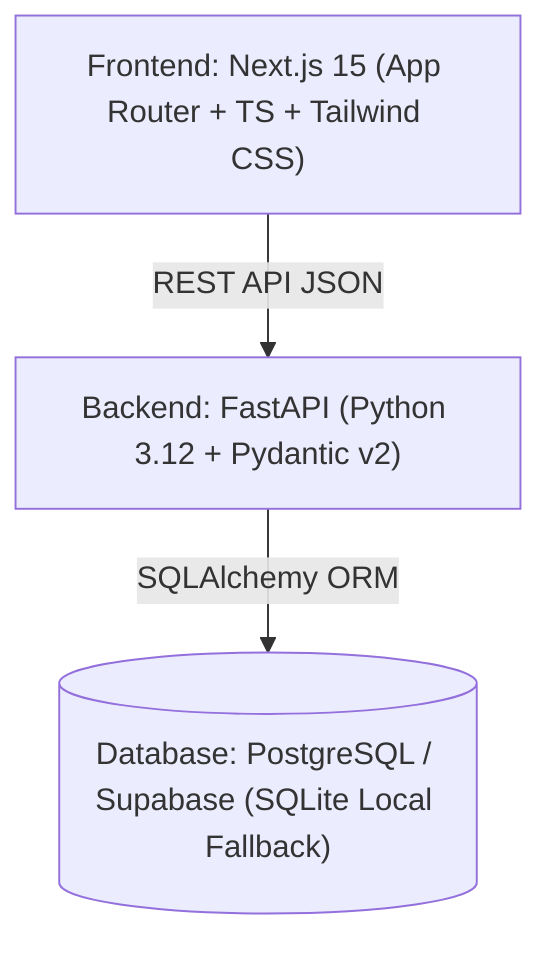

# CETCompass 🧭

### Navigate Your Engineering Future

> **CETCompass is a data-driven MHT-CET engineering college recommendation platform that helps students discover and compare suitable Maharashtra engineering colleges based on their percentile, branch, seat type, and historical cutoff data.**

Built with **Next.js 15, TypeScript, Tailwind CSS, FastAPI, SQLAlchemy, and PostgreSQL / Supabase**, powered by an authentic dataset of **28,377 official historical CAP round cutoff records** across **326 accredited engineering institutions**, **94 disciplines**, and **77 seat categories**.

---

## 🌟 Key Features

1. **Student Predictor Engine**:
   - Classifies college options into **Safe, Moderate, and Reach** using mathematical cutoff margins ($\Delta = P_{\text{student}} - \text{Cutoff}_{\text{min}}$) and cohort averages.
   - Evaluates scores against exact CAP quotas (`GOPENS`, `LOPENH`, `TFWS`, `EWS`, `AI`, `GOBCH`, `GSCH`, `GSTH`, etc.).
   - Computes a transparent **Recommendation Score (0–100)** incorporating cutoff safety buffers, proximity to admitted cohort mean, and cohort size confidence.

2. **326 Institutions Directory**:
   - Faceted search across all Maharashtra colleges with real-time filtering by Name, District (Pune, Mumbai, Nagpur, Nashik, etc.), Region, and Branch.
   - Summarizes offered branches, cutoff spreads, and accreditation status.

3. **In-Depth College Profiles**:
   - Detailed branch-by-branch cutoff matrices displaying Historical Minimum (the cutoff threshold), Cohort Mean, Topper Maximum, and Admitted Cohort Size.
   - Interactive **"Check My Eligibility"** calculator directly on the college profile.

4. **Multi-College Comparison Tool**:
   - Compare 2 to 4 colleges side-by-side across common engineering branches (Computer Engineering, IT, AI & Data Science, Electronics & Telecom, Mechanical, Electrical, Civil).

5. **Candidate Dashboard**:
   - Shortlist & bookmark target colleges with custom notes for planning CAP round option forms.
   - Automatically tracks past prediction queries with one-click re-run capability.

6. **Admin & Dataset Management**:
   - Real-time dataset metrics, distribution analytics across score systems (MHT-CET, JEE Main, Merit) and administrative regions.
   - Ingestion pipeline with `.xlsx` upload interface to support future annual CAP updates.

7. **Educational Advisory & Integrity**:
   - **Zero Fabricated Data**: 100% of cutoffs, institutions, and categories are parsed strictly from the cleaned historical dataset.
   - Prominent disclaimers distinguishing historical cutoff analysis from official CET Cell seat guarantees.

---

## 📐 Transparent Prediction Methodology

Instead of a black-box ML model with arbitrary probability claims, the recommendation engine calculates the cutoff margin:

$$\Delta = P_{\text{student}} - \text{Cutoff}_{\text{min}}$$

### Classification Logic:
- **Safe (Likely Admission)**: $\Delta \ge +3.00\%$ or $P_{\text{student}} \ge \text{Cutoff}_{\text{mean}}$
  *The candidate's score comfortably exceeds the historical cutoff threshold and cohort mean.*
- **Moderate (Target Match)**: $0.00\% \le \Delta < +3.00\%$
  *The candidate's percentile meets or marginally exceeds the previous cutoff. Highly competitive and realistic target.*
- **Reach (Ambitious Match)**: $-4.00\% \le \Delta < 0.00\%$
  *The historical cutoff was slightly higher than the candidate's score. Viable for subsequent CAP rounds (Round 2/3) or spot admissions.*

---

## 🏗️ Architecture & Tech Stack



- **Frontend**: Next.js 15, TypeScript, Tailwind CSS v4, Lucide Icons.
- **Backend**: Python 3.12, FastAPI, Pydantic v2, SQLAlchemy 2.0, Uvicorn.
- **Database**: PostgreSQL (Supabase) with local SQLite fallback.
- **Data Pipeline**: Pandas, OpenPyXL.

---

## 🗄️ Database Schema

- `colleges`: `id`, `name`, `slug`, `code`, `district`, `city`, `region`, `status`, `created_at`.
- `branches`: `id`, `name`, `slug`, `category`, `created_at`.
- `seat_types`: `id`, `code`, `category`, `quota_scope`, `gender`, `description`.
- `cutoff_records`: `id`, `college_id`, `branch_id`, `seat_type_id`, `score_type`, `min_cutoff`, `max_cutoff`, `mean_cutoff`, `sum_score`, `count`, `range_cutoff`, `max_mean_diff`.
- `users`: `id`, `email`, `full_name`, `role`, `created_at`.
- `saved_colleges`: `id`, `user_id`, `college_id`, `branch_id`, `notes`, `created_at`.
- `prediction_history`: `id`, `user_id`, `percentile`, `score_type`, `seat_type`, `preferred_branches`, `preferred_locations`, `total_matches`, `safe_count`, `moderate_count`, `reach_count`, `created_at`.
- `dataset_metadata`: `id`, `filename`, `total_records`, `colleges_count`, `branches_count`, `seat_types_count`, `status`, `ingested_at`.

---

## 🚀 Quickstart & Local Setup

### 1. Prerequisites
- Python 3.10+
- Node.js 18+ and npm

### 2. Backend Setup
```bash
# In project root:
pip install -r requirements.txt # or: pip install fastapi uvicorn sqlalchemy pydantic pydantic-settings pandas openpyxl pytest

# Ingest the 28,377 cutoff records from data/college_data_cleaned.xlsx:
python -m backend.app.data.ingest

# Run backend API server:
python -m uvicorn backend.app.main:app --host 127.0.0.1 --port 8000 --reload
```
API Documentation will be available at: `http://127.0.0.1:8000/docs`.

### 3. Frontend Setup
```bash
# In frontend directory:
cd frontend
npm install
npm run dev
```
Web application will be accessible at: `http://localhost:3000`.

---

## 🧪 Automated Testing

### Backend Unit & Integration Tests (65 tests)
```bash
python -m pytest backend/tests/
```
All tests validate:
- Safe / Moderate / Reach classification boundaries
- Score margin calculations and cohort adjustments
- API endpoints: `/api/health`, `/api/stats`, `/api/colleges`, `/api/predict`, `/api/branches`, `/api/seat-types`, `/api/locations`.

### Frontend Typecheck & Build
```bash
cd frontend
npm run build
```
Builds all routes with zero TypeScript or linting errors.

---

## ☁️ Deployment Guide

### Database (Supabase PostgreSQL)
1. Create a project at [supabase.com](https://supabase.com).
2. Copy the Connection String from **Project Settings -> Database** (`postgresql://postgres:[PASSWORD]@[HOST]:5432/postgres`).
3. Set `DATABASE_URL` in your environment.
4. Run `python -m backend.app.data.ingest` to seed the database with all 28,377 records.

### Backend (Render)
1. Create a **Web Service** on Render pointing to your Git repository.
2. Build command: `pip install -r requirements.txt`
3. Start command: `python -m uvicorn backend.app.main:app --host 0.0.0.0 --port $PORT`
4. Add Environment Variables:
   - `DATABASE_URL`: Your Supabase connection string.

### Frontend (Vercel)
1. Import the repository on [Vercel](https://vercel.com).
2. Root Directory: `frontend`
3. Environment Variables:
   - `NEXT_PUBLIC_API_URL`: `https://your-backend.onrender.com/api`
4. Deploy!

---

## ⚖️ Disclaimer
*CETCompass is an independent academic resource intended solely for educational guidance and option form planning. Real-time admission cutoffs are determined exclusively by the State Common Entrance Test Cell, Government of Maharashtra.*
