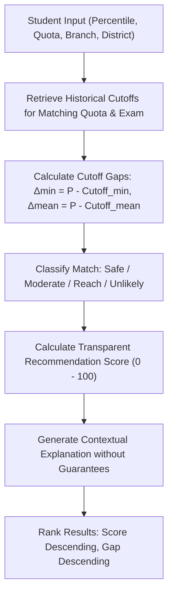

# College Recommendation Algorithm Specification

> **Document**: `docs/recommendation-algorithm.md`  
> **Module**: `recommendation_service.py` / `backend/app/services/recommendation_service.py`  
> **Status**: Production Verified  
> **Platform**: Maharashtra MHT-CET & JEE Engineering Admissions Guide  

---

## 1. Guiding Philosophy & Non-Guarantee Mandate

The College Predictor recommendation engine is built on **mathematical transparency, historical empirical data, and educational integrity**.

### Core Tenets:
1. **No Fake ML Probability Claims**: Real-world admissions depend on unobserved variables (annual candidate volume shifts, changes in branch preference popularity, localized seat matrix revisions). The system never displays fabricated "98.7% chance of getting in" or guarantees admission.
2. **Deterministic & Auditable**: Every recommendation is computed strictly from historical CAP round statistics (`min_cutoff`, `mean_cutoff`, `max_cutoff`, `count`, `range_cutoff`).
3. **Transparent Explanations**: Every result clearly presents the exact historical cutoff, the candidate's margin gap, the admitted cohort average, and an honest explanation.
4. **Independent Service**: The engine is designed as a standalone pure-Python service decoupled from web frameworks (FastAPI), allowing headless execution, batch simulations, and automated unit testing.

---

## 2. Inputs Supported

The engine accepts only parameters that map directly to the dataset structure:

| Input Field | Type | Domain / Constraints | Description |
| :--- | :--- | :--- | :--- |
| `percentile` | Float | `0.00` to `100.00` | The student's normalized MHT-CET or JEE Main percentile score. |
| `seat_type` | String | 77 CAP Quotas | The candidate's reservation category code (e.g. `GOPENS`, `LOPENH`, `TFWS`, `EWS`, `AI`, `GOBCH`, `GSCH`). |
| `score_type` | String | `MHT-CET`, `JEE(Main)` | Examination scoring channel (defaults to `MHT-CET`). |
| `preferred_branches` | List[str] | Optional | List of engineering branch titles to filter by (e.g. `["Computer Engineering", "Information Technology"]`). |
| `preferred_locations` | List[str] | Optional | List of target districts (e.g. `["Pune", "Mumbai"]`) or administrative regions. |
| `preferred_categories`| List[str] | Optional | High-level discipline groups (e.g. `["Computer Science & IT"]`). |

---

## 3. Step-by-Step Algorithm Workflow



### Step 1: Candidate Cutoff Retrieval
For each institution and branch:
- Matches `score_type` and candidate's `seat_type`.
- Evaluates against historical minimum cutoff ($Cutoff_{\text{min}}$), cohort mean ($Cutoff_{\text{mean}}$), topper score ($Cutoff_{\text{max}}$), cohort count ($N$), and spread ($Cutoff_{\text{range}}$).

### Step 2: Cutoff Gap Calculation
The candidate's relative position is calculated as:

$$\Delta_{\text{min}} = P_{\text{student}} - Cutoff_{\text{min}}$$

$$\Delta_{\text{mean}} = P_{\text{student}} - Cutoff_{\text{mean}}$$

$$\Delta_{\text{max}} = P_{\text{student}} - Cutoff_{\text{max}}$$

### Step 3: Classification Logic & Configurable Thresholds

The classification thresholds are stored in `RecommendationConfig` rather than hardcoded throughout the code:

```python
@dataclass
class RecommendationConfig:
    safe_min_gap: float = 3.0      # Minimum margin above cutoff for Safe
    moderate_min_gap: float = 0.0  # Boundary for Moderate
    reach_max_gap: float = 4.0     # Maximum aspirational deficit for Reach
    min_score: float = 5.0
    max_score: float = 99.0
    high_confidence_count: int = 15
    medium_confidence_count: int = 5
```

#### Category Definitions:
1. **`SAFE` (Comfortable Match)**:
   - **Condition**: $\Delta_{\text{min}} \ge \text{safe\_min\_gap}$ ($+3.00\%$) OR $P_{\text{student}} \ge Cutoff_{\text{mean}}$
   - **Rationale**: The student's performance exceeds the historical entry barrier with a generous cushion or surpasses the average admitted student. In typical CAP round allotment cycles, this option has a high degree of stability.
2. **`MODERATE` (Competitive Target)**:
   - **Condition**: $\Delta_{\text{min}} \ge \text{moderate\_min\_gap}$ ($0.00\%$) and below Safe conditions.
   - **Rationale**: The student cleared the historical minimum threshold but falls below the cohort mean or safe buffer. If cutoffs rise by 1–2 percentile points due to higher applicant demand, admission may be borderline.
3. **`REACH` (Ambitious Match)**:
   - **Condition**: $-\text{reach\_max\_gap} \le \Delta_{\text{min}} < 0.00\%$ (within $4.00\%$ of cutoff).
   - **Rationale**: The student scored below last year's cutoff, but within typical subsequent CAP round drops (Round 2, Round 3, or institutional spot rounds). Recommended as top aspirational choices on the option form.
4. **`UNLIKELY` (High Deficit)**:
   - **Condition**: $\Delta_{\text{min}} < -\text{reach\_max\_gap}$ (more than $4.00\%$ below cutoff).
   - **Rationale**: Historically inaccessible based on available cutoff statistics.

---

### Step 4: Transparent Recommendation Score Formulation

The score scales from **$5.0$ to $99.0$** (never $100.0$ to ensure no false promise of guaranteed admission). It is computed as the sum of four transparent components:

$$\text{Score} = S_{\text{margin}} + S_{\text{mean}} + S_{\text{stability}} + S_{\text{cushion}}$$

1. **Margin Component ($S_{\text{margin}}$, 0 to 50 pts)**:
   - If $\Delta_{\text{min}} \ge 10.0$: $50.0$
   - If $0.0 \le \Delta_{\text{min}} < 10.0$: $35.0 + 1.5 \times \Delta_{\text{min}}$
   - If $-4.0 \le \Delta_{\text{min}} < 0.0$: $15.0 + 5.0 \times (4.0 + \Delta_{\text{min}})$
   - If $\Delta_{\text{min}} < -4.0$: $\max(5.0, 15.0 + 2.0 \times \Delta_{\text{min}})$
2. **Cohort Mean Proximity ($S_{\text{mean}}$, 0 to 25 pts)**:
   - If $P_{\text{student}} \ge Cutoff_{\text{mean}}$: $20.0 + \min(5.0, \Delta_{\text{mean}} \times 0.5)$
   - If $P_{\text{student}} < Cutoff_{\text{mean}}$: $\max(5.0, 20.0 + \Delta_{\text{mean}} \times 1.5)$
3. **Cohort Stability Confidence ($S_{\text{stability}}$, 0 to 15 pts)**:
   - Evaluates sample size $N = count$:
     - $N \ge 15$: $15.0$ pts (Large cohort = low year-on-year volatility)
     - $5 \le N < 15$: $12.0$ pts
     - $2 \le N < 5$: $10.0$ pts
     - $N = 1$: $7.0$ pts (Single-seat quotas exhibit higher fluctuation)
4. **Spread Cushion Factor ($S_{\text{cushion}}$, 0 to 10 pts)**:
   - Reward wide historical cohorts: $\min(10.0, 5.0 + Cutoff_{\text{range}} \times 0.2)$

---

### Step 5: Contextual Explanations

Each result provides an exact factual explanation:
- **Safe**:
  > *"Your percentile of 95.50 is +3.20 points above the historical minimum cutoff (92.30) and exceeds the admitted cohort average (94.10)."*
- **Moderate**:
  > *"Your percentile of 91.50 is close to the historical minimum cutoff (90.80) with a +0.70 point margin, making this a realistic, competitive target."*
- **Reach**:
  > *"Your percentile of 88.50 is 1.50 points below the historical minimum cutoff (90.00). This represents an ambitious choice that may become viable in subsequent CAP rounds."*
- **Prohibited Terminology**: The engine strictly forbids deterministic guarantees like *"You will definitely get this college"* or *"Admission is guaranteed"*.
- **Standard Disclaimer**: Every result object carries:
  > *"Recommendations are based on historical CAP round cutoff statistics and do not guarantee admission. Actual cutoffs fluctuate annually based on exam difficulty, applicant registrations, and seat matrix revisions."*

---

## 4. Empirical Dataset Analysis & Threshold Justification

Our audit of the 28,377 records revealed:
- **Median Cutoff Spread (`max - min`)**: $0.06\%$ (in small quotas) up to $9.18\%$ (75th percentile).
- **Cohort Count Distribution**: 50% of quotas represent 1 or 2 seats; the top 25% have 4 to 92 seats.
- **Subsequent Round Volatility**: Historical CAP round analysis shows that cutoffs for in-demand disciplines typically drop by $0.50\%$ to $3.50\%$ between Round 1 and Round 3. Setting `safe_min_gap = 3.0` ensures a student has enough buffer to remain resilient against upward cutoff shifts, while `reach_max_gap = 4.0` captures realistic aspirational seats.

---

## 5. Verification & Test Coverage

The engine is covered by automated unit tests in `backend/tests/test_recommendation_engine.py`:
- `test_high_percentile`: Tests top-tier student performance against elite institutions (COEP, PICT, VIT).
- `test_low_percentile`: Validates handling of below-cutoff candidates and unlikely designations.
- `test_boundary_cases`: Validates exact boundary conditions ($\Delta = 0.00$, $\Delta = +3.00$, $\Delta = -4.00$, $P = Cutoff_{\text{mean}}$).
- `test_missing_data`: Validates handling of null inputs.
- `test_invalid_inputs`: Asserts rejection of negative percentiles, percentiles $> 100$, non-numeric values, empty strings, and corrupted cutoffs.
- `test_different_seat_types`: Verifies reservation category isolation (`TFWS`, `EWS`, `GOPENS`).
- `test_different_branches`: Verifies course discipline filtering.
- `test_configurable_thresholds`: Asserts dynamic behavior when modifying configuration thresholds.
- `test_no_admission_guarantee_language`: Scans all output text to confirm zero presence of forbidden guarantee phrases.
